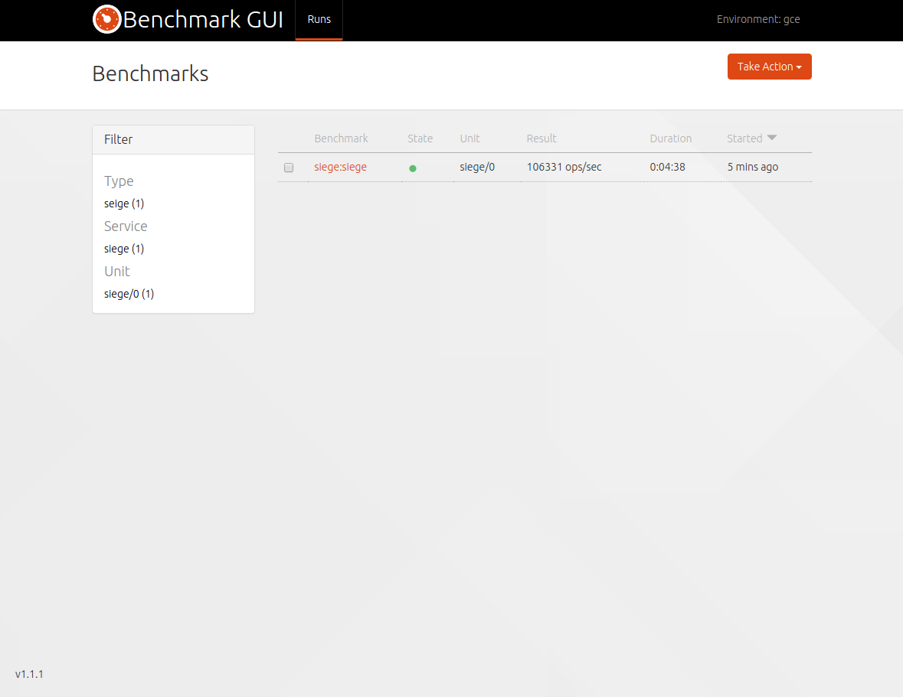

# Introduction

Here's a short video outlinging what Benchmarking looks like with Juju

OMG VIDEO

# Deploy a workload

We'll deploy an example workload to run benchmarks against. For an exhaustive
list of all benchmarks available please see the [All Benchmarks]() section.

```
juju deploy mediawiki
juju deploy mariadb
juju add-relation mariadb mediawiki:db
```

# Add a load generator

Since this is a typical three tier web infrastructure, we'll add [siege]() to
create load over HTTP

```
juju deploy siege
juju add-relation mediawiki siege
```

# Run a benchmark

Either visit the benchmark-gui address or issue the following command

```
juju action do siege/0 siege concurrent=30
Action queued with: c3dfec96-8efe-11e5-932d-17d2f80bf113
```

## Get results!

```
juju action fetch c3dfec96-8efe-11e5-932d-17d2f80bf113
results:
  meta:
    composite:
      direction: desc
      units: ops/sec
      value: "106331"
    raw: |
      Sleeping 2s...
      Warming up WRITE with 50000 iterations...
      Running WRITE with 200 threads for 1000000 iteration

      [SNIP. Raw output from the load generator]

      END
    start: 2015-11-18T21:08:48Z
    stop: 2015-11-18T21:13:22Z
  results:
    latency-95th-percentile:
      direction: asc
      units: ""
      value: "2.4"
    latency-99th-percentile:
      direction: asc
      units: ""
      value: "4.4"
    latency-max:
      direction: asc
      units: ""
      value: "204.0"
    latency-mean:
      direction: asc
      units: ""
      value: "1.9"
    latency-median:
      direction: asc
      units: ""
      value: "1.5"
    op-rate:
      direction: desc
      units: op/s
      value: "106331"
    partiton-rate:
      direction: desc
      units: pk/s
      value: "106331"
    row-rate:
      direction: desc
      units: row/s
      value: "106331"
    total-errors:
      direction: asc
      units: ""
      value: "0"
    total-operation-time:
      units: ""
      value: "00:00:09"
    total-partitions:
      units: ""
      value: "1000000"
status: completed
timing:
  completed: 2015-11-18 21:13:24 +0000 UTC
  enqueued: 2015-11-18 21:08:43 +0000 UTC
  started: 2015-11-18 21:08:44 +0000 UTC
```

Repeat, rerun, record!

# Benchmark infrastructure

Finally, we add some additional supporting infrastructure to allow metrics and
benchmark data to be collected as well as providing an easy to use GUI

```
juju deploy benchmark-gui
juju deploy benchmark-collector
juju add-relation benchmark-gui seige
juju add-relation benchmark-collector siege
juju add-relation benchmark-collector mediawiki
juju add-relation benchmark-collector mariadb
juju add-relation benchmark-collector benchmark-gui
```


